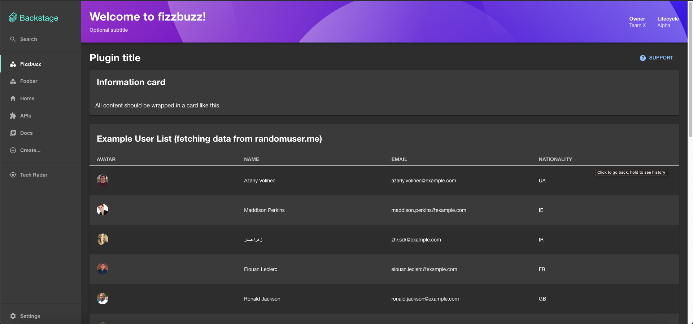

# Backstage Bootstraper
Sample CLI project to bootstraper Backstage; generate Backstage project with user-defined plugins. 
Available plugins are `fizzbuzz` and `foobar` which will create a new page with Sidebar.



## Prerequisites
- Node.js v18
- Yarn

## Usage

### Building
To build a project:

```shell
$ yarn build
```

### Bootstrapping

To bootstrap a Backstage project name `demo` with plugins `fizzbuzz` and `foobar`:

```shell
$ yarn start create demo -p fizzbuzz,foobar
```

To bootstrap a Backstage project name `demo` with a plugin `fizzbuzz`:

```shell
$ yarn start create demo -p fizzbuzz
```

To run a generated Backstage application, run:

```shell
$ cd path/to/your/backstage/repo && yarn install && yarn dev
```

To see the command definition, run:

```shell
$ yarn start create -h                     

Usage: backstage-bootstraper create [options] <project-name>

create a new project in a new directory

Arguments:
  project-name            Project name

Options:
  -p, --plugins <plugin>  Plugins (default: ",")
  -h, --help              display help for command
```
